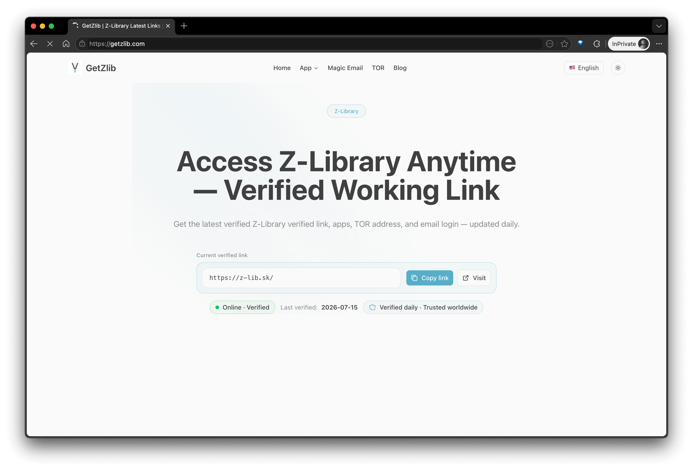

# GetZLib — 최신 Z-Library 공식 사이트, 주소, 매직 이메일 및 앱

**현재 이용 가능한 Z-Library 접속 정보를 빠르게 확인하세요.**

[English](./README.md) · [简体中文](./README.zh-CN.md) · [日本語](./README.ja.md) · [한국어](./README.ko.md)

> [!IMPORTANT]
> Z-Library 사이트 주소, 매직 이메일 및 앱 다운로드 정보는 언제든 변경될 수 있습니다. 최신 내용은 **[GetZLib.com](https://getzlib.com/)** 에서 확인하세요.

[최신 Z-Library 사이트](https://getzlib.com/) · [매직 이메일](https://getzlib.com/magic-email) · [앱 다운로드](https://getzlib.com/app/android) · [Z-Library 가이드](https://getzlib.com/blog)

## GetZLib으로 Z-Library 찾기

GetZLib은 Z-Library 공식 사이트, 최신 Z-Library 링크, Z Library 최신 주소,
매직 이메일 사용법 및 Z-Library 앱 다운로드를 찾는 이용자를 위한 독립 정보
가이드입니다. 오래된 도메인을 검색하는 대신
[GetZLib.com](https://getzlib.com/)에서 현재 접속 정보와 실용 가이드를 한곳에
확인할 수 있습니다.

## 최신 Z-Library 사이트와 주소 확인하기

Z-Library 주소는 변경될 수 있으므로 정적 README에 저장된 링크는 빠르게
오래될 수 있습니다. [GetZLib 홈페이지](https://getzlib.com/)는 최신 사이트
정보와 지원되는 접속 방식을 안내합니다. 페이지를 북마크하고 현재 Z-Library
주소가 필요할 때 방문하세요.

## Z-Library 매직 이메일 및 앱 다운로드

[매직 이메일 가이드](https://getzlib.com/magic-email)에서 개인 접속 링크를
받는 방법을 확인할 수 있습니다. 모바일 또는 데스크톱에서 이용하려면 먼저
[Z-Library Android 앱 페이지](https://getzlib.com/app/android)를 확인하세요.
Windows, macOS 및 Linux용 안내도 GetZLib에서 찾을 수 있습니다.

## 면책 고지

GetZLib은 독립 정보 프로젝트이며 Z-Library가 운영하거나 제휴한 서비스가
아닙니다. GetZLib은 책을 저장하지 않습니다. 타사 서비스를 책임감 있게
이용하고 거주 지역에 적용되는 법률과 저작권 규정을 준수하세요.
